# Target architecture: clean architecture for invox

This is the spec for the experiment on branch `experiment/clean-architecture`. It describes how the
code is structured when the refactor is done. `internal/archtest/target_test.go` checks it, and
`scripts/verify-target.sh --target` passing is the definition of done.

Everything in `docs/design/target/`, `internal/archtest/target_test.go` and
`scripts/verify-target.sh` is frozen. The verify script fails if any of them changes. If you think a
rule here is wrong, record it in `docs/design/target-progress.md` under "Blockers" and work around
it; never edit the frozen files.



## The dependency rule

Source dependencies point inward only:

1. **Entities** (`invoice`, `numbering`, `epc`, `money`) hold the business data and rules. They
   import the standard library and `money`, and nothing that touches the disk.
2. **Use cases** (`billing`) hold the application's steps. `billing` imports only the entities and
   declares the interfaces it needs from the outside world.
3. **Interface adapters** implement those interfaces (driven: `store`, `archive`, `render/latex`,
   `email`, `adapters/tectonic`, `adapters/applemail`) or call the use cases (driving: `cli`, the
   commands, `cli/cmdutil`, `cli/helptext`, `tableprinter`, `adapters/editor`, `adapters/opener`).
4. **Main** (`factory`, `cmd/invox`, `docs/gen`) builds and wires everything.
5. **Libraries** (`config`, `fsutil`, `adapters/run`, `iostreams`, `env`, `build`, cobra, pflag,
   yaml.v3) are imported by the outer rings only.

Folders are named after what they hold, not after rings. The rings are rules, enforced by
`target_test.go` and, by the end, by `.golangci.yml` and `internal/archtest/archtest_test.go`.

## Packages and their allowed imports (normative)

The diagram illustrates this table. Where they differ, the table wins. "Core" means `invoice`,
`numbering`, `epc`, `money` and `billing`.

| Ring | Package | Holds | May import |
|---|---|---|---|
| Entities | `internal/invoice` | `Invoice`, `Position`, `Customer`, `Issuer`, `Payment`, `Status` (with its transition table), `Problem`; value types (`Text`, `Decimal`, `Rate`, `Date`); VAT totals in cents; validation returning `[]Problem`. No YAML tags, no `Host`. | standard library, `money`. Not `os`, `io/fs`, `os/exec`, `net`, `syscall`. |
| Entities | `internal/numbering` | Number pattern parsing, `Format`, `Parse`, next counter from the highest seen. | standard library, no disk |
| Entities | `internal/epc`, `internal/money` | Unchanged. | standard library, no disk |
| Use cases | `internal/billing` | `Service` with the 14 use cases, the six interfaces below, `Settings` (numbering pattern and start, email templates), and every error type the CLI words (for example `ToolMissingError`, `ConfigError`). Email subject and body templating moves here from `internal/email`. EPC eligibility and payload (today `invoice/epc_qr.go`) move here. | core only, no disk |
| Driven | `internal/store` | YAML decoding (the strict decoder, alias limits, duplicate keys, removed-key messages), comment-keeping writes, Markdown front matter, config and support-file lookup, the legacy directory, `init` starter files (`starter/`). Implements `Invoices` and `Directory`. | core, `config`, `fsutil`, yaml.v3 |
| Driven | `internal/archive` | Archive directory, `.history` backups, name resolution. Implements `Archive`. Reads invoice identity through a reader function that `factory` takes from `store`. | core, `fsutil` |
| Driven | `internal/render/latex` | Placeholder table, escaping, line item blocks, template checks, asset copying. Implements `Renderer`. | core, `fsutil` |
| Driven | `internal/email` | The .eml MIME layout and the temp-dir policy (now in the `email` command). Implements `Mailer`. | core, `fsutil` |
| Driven | `internal/adapters/tectonic`, `internal/adapters/applemail` | Implement `Compiler` and `Mailer` on `adapters/run`. | core, `adapters/run`, `iostreams` |
| Driving | `internal/cli/...`, `internal/cmd/...`, `internal/tableprinter`, `internal/adapters/editor`, `internal/adapters/opener` | Flags, help, exit codes, prompts, `--json`, tables, the editor and the opener. Each command calls one `Service` method and prints its result. `cli/cmdutil.Factory` keeps its fields; `factory` fills them. `cli/helptext` fills paths from `Service.Paths()`. | core, other driving packages, `adapters/run`, `iostreams`, `env`, `build`, cobra, pflag. Never a driven adapter, `config`, `fsutil` or `factory`. |
| Main | `internal/factory` | The composition root. Reads `config.yaml` and `env.Env`, applies `--config`, `--customers` and `--issuer` to `store`, picks the `Mailer` (Apple Mail on macOS without `--output`, .eml otherwise), builds `billing.Service`, fills `cmdutil.Factory`. | anything except `internal/cli` (the root package) and `internal/cmd/...` |
| Main | `cmd/invox` | Process entry. | `factory`, `cli`, `iostreams`, `env`, `adapters/run` |
| Main | `internal/docs/gen` | Docs generator. | `factory`, `cli`, `cli/cmdutil`, `cli/helptext`, `fsutil`, `iostreams`, `env`, `adapters/run`, cobra |
| Libraries | `internal/config`, `internal/fsutil`, `internal/adapters/run`, `internal/iostreams`, `internal/env`, `internal/build` | Unchanged. | standard library (`config` also yaml.v3) |

## The six interfaces

Round 2 note: `docs/design/ports-v2.md` supersedes the draft below and is normative for the
ports, with one change made by the coordinator: `Compiler` is not a billing port. The renderer is
its only caller, so `render/latex` declares it and `factory` gives the renderer a compiler;
`billing.Service` has no `Compiler` field.

Owned by `billing`. The method names are fixed (the target test checks them). The signatures are a
first draft: change parameter and result types when the implementation shows a better shape, but
keep them in core types.

```go
package billing

// Invoices reads and writes invoice files. Update keeps the file's comments
// and layout; TestInvoiceWritesKeepComments pins that today.
type Invoices interface {
	Load(path string) (invoice.Invoice, error)
	Create(path string, inv invoice.Invoice, overwrite bool) error
	Update(path string, change func(*invoice.Invoice) error) error
}

// Directory answers which customers, issuer, defaults and template apply.
type Directory interface {
	Customer(id string) (invoice.Customer, error)
	Customers() ([]invoice.Customer, error)
	Issuer() (invoice.Issuer, error)
	Defaults() (invoice.Invoice, error)
	Template(ref string) (Template, error)
	Templates() ([]Template, error)
	Paths() ([]PathReport, error)
	EditablePath(f File) (string, error)
	Init() ([]InitFile, error)
}

// Archive holds finished invoices.
type Archive interface {
	Entries() ([]ArchiveEntry, error)
	Add(src string, inv invoice.Invoice, replace bool) (ArchiveResult, error)
	Checkout(ref, workDir string) (string, error)
}

// Renderer turns an invoice into the source the Compiler reads.
type Renderer interface {
	Render(t Template, inv invoice.Invoice, epcPayload string) (string, error)
}

// Compiler turns rendered source into a PDF and returns its path.
type Compiler interface {
	Compile(ctx context.Context, sourcePath string) (string, error)
}

// Mailer drafts an email with the PDF attached. It returns where the draft
// went: an .eml path, or "" when a mail app opened it.
type Mailer interface {
	Draft(ctx context.Context, m Message) (string, error)
}

type Service struct {
	Invoices  Invoices
	Directory Directory
	Archives  Archive // not "Archive": Service has an Archive method
	Renderer  Renderer
	Compiler  Compiler
	Mailer    Mailer
	Settings  Settings
	Now       func() time.Time
}
```

## Use cases

Each is a method on `*billing.Service`. The target test checks that all 14 exist.

| Method | Command | Calls | Today in |
|---|---|---|---|
| `New` | `new` | `Directory`, `Archives.Entries`, `Invoices.Create`, `numbering` | `Host.CreateNewInvoice` (drafts.go) |
| `Increment` | `increment` | `Invoices.Update`, `Archives.Entries`, `numbering` | `Host.IncrementInvoiceNumber` |
| `Validate` | `validate` | `Invoices.Load`, `Directory`, invoice validation | `LoadContext` (context.go) |
| `Render` | `render` | `Invoices.Load`, `Directory`, `epc`, `Renderer` | `Host.RenderInvoice`, `RenderTeX` |
| `Build` | `build` | everything `Render` calls, then `Compiler`, `Invoices.Update`, and `Archives.Add` with `--archive` | `buildRun` (cmd/invoice/build), `Host.BuildInvoicePDF`, `MarkInvoiceBuilt` |
| `Archive` | `archive add` | `Invoices.Load`, `Archives.Add` | `Host.ArchiveInvoice` |
| `EditArchived` | `archive edit` | `Archives.Checkout`, `Invoices.Update` | `Host.EditArchivedInvoice` |
| `DraftEmail` | `email` | `Invoices.Load`, `Directory`, `Mailer` | `Host.PrepareInvoiceEmail`, `CreateInvoiceEmailDraft`, `emailRun` |
| `ListCustomers` | `customer list` | `Directory.Customers` | `ListCustomers` |
| `ListArchive` | `archive list` | `Archives.Entries` | `Host.ListArchivedInvoices` |
| `Paths` | `config paths`, help | `Directory.Paths` | `Host.Paths` |
| `Init` | `init` | `Directory.Init` | `Host.InitializeConfigDir` |
| `ListTemplates` | `template list` | `Directory.Templates` | `Host.ListTemplates` |
| `EditablePath` | `config edit`, `customer edit` | `Directory.EditablePath`; the command opens `$EDITOR` itself | `Host.EditableConfigPath`, `cmdutil.SupportPath` |

## Where today's code goes

| Today | Target |
|---|---|
| `invoice/models.go`, `scalars.go` | Types and validation to `invoice`, without YAML tags. `decodeScalar`, the YAML tags and `removedKey` to `store`. |
| `invoice/context.go` | VAT and totals to `invoice`. `LoadContext`'s orchestration to `billing.Validate` and `billing.Render`. |
| `invoice/yaml.go`, `yamldoc.go`, `customers.go` | `store` |
| `invoice/host.go`, `sources.go`, `config_paths.go`, `templates.go`, `abs_path.go`, `init.go`, `starter/` | `store`. `DisplayPath` and `ReplaceExt`, which only the CLI uses, to `cli/cmdutil`. |
| `invoice/numbering.go` | Pattern, format and parse to `numbering`. Counter scanning to `billing.New` over `Archives.Entries`. `writeInvoiceNumber` becomes an `Invoices.Update`. YAML node helpers to `store`. |
| `invoice/drafts.go` | The decisions in `CreateNewInvoice`, `IncrementInvoiceNumber`, `ArchiveInvoice`, `EditArchivedInvoice` to `billing`. File moves and `_invox` metadata to `store` and `archive`. |
| `invoice/archive.go`, `archive_replace.go` | Listing and lookup to `archive`. `readArchivedIdentity` to `store`. Status rules to `invoice.Status`. Options and results to `billing`. |
| `invoice/render.go`, `assets.go` | `buildTemplateValues`, `RenderTeX`, asset copying to `render/latex`. `BuildInvoicePDF`'s orchestration to `billing.Build`. |
| `invoice/epc_qr.go` | `billing`, using `epc` |
| `invoice/email.go`, `internal/email` | Status check, recipient, subject and body to `billing.DraftEmail`. MIME building stays in `email`, which becomes a `Mailer`. Draft path lookup to `store`. |
| `invoice/errors.go` | Business errors (unknown customer, validation, duplicate number) to `invoice` and `billing`. File errors (output exists, output is a directory, decode error) to `store`, wrapped in `billing` error types the CLI can match. |
| `cmd/invoice/build` `buildRun` | `billing.Build` |
| `cmd/invoice/email` delivery choice, temp-dir pruning | `factory` picks the `Mailer`. Pruning to `email`. |
| `cli/cmdutil` `NewFactory`, `newHost`, `SupportPath` | `factory` and `store`. The flag wording in `SupportPath`'s errors stays in `cmdutil`. |
| `cli/exit.go` matching `tectonic.NotInstalledError`, `config.Error` | Matches `billing.ToolMissingError` and `billing.ConfigError`, which the adapters and `factory` return. `cli` stops importing `adapters/tectonic` and `config`. |

## Decisions already made

- **Comment-keeping writes.** `Invoices.Update` takes a change function. `store` decodes the node
  tree, applies the change to the entity, and writes back only the fields that changed, keeping
  comments, merge keys and layout. This is the hardest part of the refactor.
- **One `billing` package.** Split it only if it grows past roughly 1,500 lines.
- **Flags stay outside the core.** `--config`, `--customers` and `--issuer` configure `store` inside
  `factory`. No use case sees a flag name.
- **Editor and opener stay in the CLI.** Opening `$EDITOR` is user interaction.
- **The clock is a field.** `Service.Now` replaces today's `now time.Time` parameters.

## What is fixed and what is yours to decide

Fixed: the package list and allowed imports above, the six interface names and their method names,
`Service` and its 14 method names, the entity type names, and the invariants below.

Yours: file names inside a package, unexported helpers, parameter and result types of the
interface methods (within core types), extra methods, extra unexported packages under a package
you own (for example `internal/store/yamlx`), test helpers, and the order of work inside a step.

## Invariants (checked by `scripts/verify-target.sh`)

- `go build`, `go vet`, `gofmt`, `go mod tidy -diff`, `go test -race ./...` and `make lint` pass.
- **Output does not change.** The 35 testscript files under `cmd/invox/testdata`, `docs/cli` and
  `share/man` stay byte-for-byte equal to the base commit, and regenerating the docs reproduces them.
  Never run `go test ./cmd/invox -run TestScript -update`.
- **No test disappears.** Every test and fuzz function listed in `baseline-tests.txt` still exists
  under some package. Moving and rewriting tests is expected; a test that no longer applies needs a
  line `- TestName: reason` in `docs/design/target-removed-tests.md`.
- **No new skips.** The count of `t.Skip` does not rise above `baseline-skips.txt`.
- **Fixtures keep their contents.** Every file in `baseline-fixtures.txt` still exists, by content,
  under some `testdata` directory.
- The frozen files above are unchanged.

While the refactor is in progress, the current layering rules in `.golangci.yml` and
`internal/archtest/archtest_test.go` will conflict with the target. Change them, but only toward the
table above, and by the last step make them state the table.

## Order of work

One step at a time. Each step ends with `scripts/verify-target.sh` passing, one commit, a push, and a
row in `docs/design/target-progress.md`.

1. Break the file cycles inside `internal/invoice` without changing its API: move the YAML node
   helpers out of `numbering.go`, split `drafts.go` by use case. (Cycles today: `yamldoc.go` and
   `numbering.go`; `yaml.go` and `models.go`; `drafts.go` with `archive.go` and
   `archive_replace.go`; `host.go`, `sources.go`, `config_paths.go`, `init.go`.)
2. Extract `internal/numbering`.
3. Add `invoice.Status` with its transition table, and validation returning `[]Problem`.
4. Move YAML decoding, comment-keeping writes and path resolution into `internal/store`, so
   `invoice` loses its tags and its `os` calls. The largest step; split it into several commits.
5. Add `internal/billing` with the six interfaces and `Service`; move `buildRun` and the other
   orchestration into it; make the commands call `Service`.
6. Add `internal/factory`; make `render/latex`, `email`, `archive` and the adapters implement the
   interfaces; move `cmdutil.NewFactory` into `factory`.
7. Make `.golangci.yml` and `internal/archtest/archtest_test.go` state the table above, and update
   the Layout section of `CLAUDE.md`.
